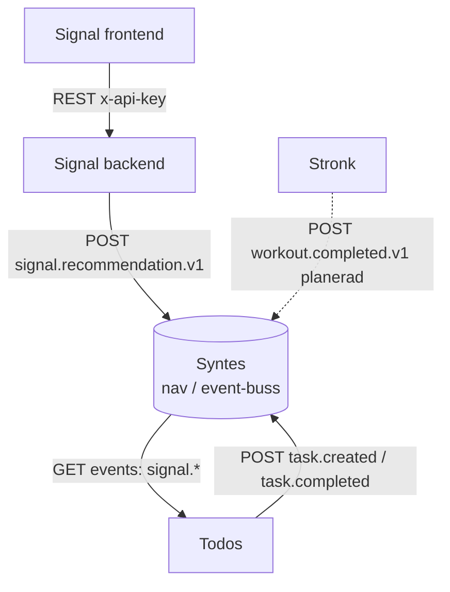

# Arkitektur & kommunikation

Hur de olika apparna kommunicerar med varandra.

## Översikt

**Syntes är navet.** Ingen app känner till någon annan app — de känner bara till Syntes
och dess regler. En app *berättar* att saker hänt (**producent**) och/eller *lyssnar*
efter att saker hänt (**konsument**). Syntes tar emot, validerar mot strikta scheman,
lagrar i en oföränderlig logg och serverar händelserna.

Grundregler:
- All kommunikation går via HTTP till Syntes API (`https://api.syntes.dev`).
- Varje app äger sin egen databas; ingen app läser direkt i en annans databas.
- Autentisering via `X-API-Key`. Scopes: `read`, `write`, `readwrite`.

Full integrationsguide (endpoints, scheman, referenskod): [syntes_integration.md](syntes_integration.md).

## Diagram

Heldragna pilar = implementerat. Streckad = planerad.

## Kommunikationssätt

| Från | Till | Kanal | Format | Anteckningar |
|------|------|-------|--------|--------------|
| Signal backend | Syntes | `POST /events` | `signal.recommendation.v1` | BUY/NEUTRAL/SELL + `signal_score` 0–100 |
| Todos | Syntes | `POST /events` | `task.created.v1`, `task.completed.v1` | fakta om uppgifter |
| Todos | Syntes | `GET /events` (polling) | konsumerar `signal.*` | skapar granskningsuppgift per BUY/SELL |
| Stronk | Syntes | `POST /events` | `workout.completed.v1` | **planerad** (schema saknas ännu) |
| Signal frontend | Signal backend | REST (`x-api-key`) | JSON | intern app-kommunikation, går **inte** via navet |

## Händelsekontrakt (scheman) — nuläge

| event_type | Producent | Syns i `/snapshot` som |
|---|---|---|
| `signal.recommendation.v1` | Signal | `open_buys` (action=BUY) |
| `task.created.v1` | Todos | _(ingen projektion ännu)_ |
| `task.completed.v1` | Todos | `today.tasks_completed` |
| `workout.completed.v1` | Stronk _(planerad)_ | `today.workout_done` (logik finns, schema saknas) |

Se [syntes_integration.md](syntes_integration.md) avsnitt 4 & 7 för schemaregler och hur
man lägger till en ny händelsetyp.

## Miljöer & endpoints

| Vad | Adress |
|-----|--------|
| Syntes maskin-API | `https://api.syntes.dev` (`/docs` för interaktiv dok) |
| Syntes människo-dashboard | `https://syntes.dev` (bakom Authelia — **inte** för maskiner) |
| Signal backend (lokalt) | `http://localhost:8000` |

## Delade konventioner

- **Scheman:** `objekt.verb.version`, dåtidsverb (`task.completed.v1`). Publicerat schema
  ändras aldrig — bryt strukturen → skapa `v2`. `additionalProperties: false`.
- **Commands:** be en annan app *göra* något via `objekt.verb.requested.v1` (imperativ);
  ägaren utför och publicerar sedan faktum-eventet.
- **Robusthet:** publicering får aldrig krascha appen (try/except + timeout). Navet är ett
  tillägg, aldrig ett beroende för kärnfunktionen.
- **Nycklar:** i `.env`, aldrig i git. Klienter som distribueras (APK/widget) får bara `read`.
