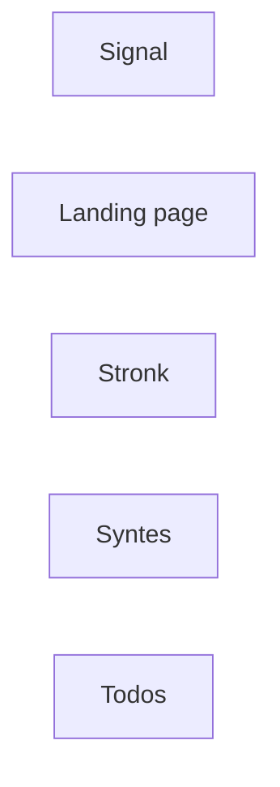

# Arkitektur & kommunikation

Det här dokumentet beskriver hur de olika apparna kommunicerar med varandra.

## Översikt

_(Kort beskrivning av det övergripande systemet — vad är kärnan, vad hänger runt
omkring?)_

## Kommunikationssätt

Beskriv per integration: vem anropar vem, över vilken kanal (HTTP/REST, events,
delad databas, meddelandekö, etc.), och vilket dataformat.

| Från | Till | Kanal | Format | Anteckningar |
|------|------|-------|--------|--------------|
| _app_ | _app_ | _t.ex. REST_ | _t.ex. JSON_ | |

## Diagram

Skiss över hur apparna hänger ihop (Mermaid renderas direkt på GitHub):

## Miljöer & endpoints

| App | Lokalt | Produktion |
|-----|--------|------------|
| _app_ | _t.ex. localhost:3000_ | _url_ |

## Delade konventioner

_(Auth, gemensamma env-variabler, namngivning, versionsstrategi, etc.)_
